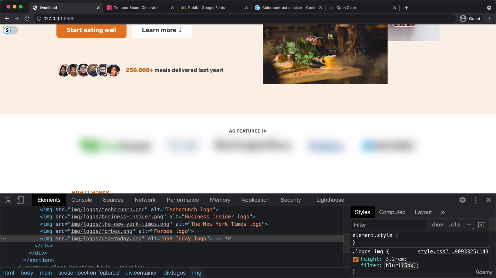

# Simform-Course-HTML-CSS

This repo contains course notes and some practical code of HTML CSS code.

Galary Index: 
Centering element:  

CSS properties to style grid template:
CODE: 
OUTPUT: 
If we aaply oerflow scroll in parent container, the the flex items will shrink to let the items get filled in space by shrinking them selves, But we can restrict srinking by using, flex-shrink:0 in flex item,: 
