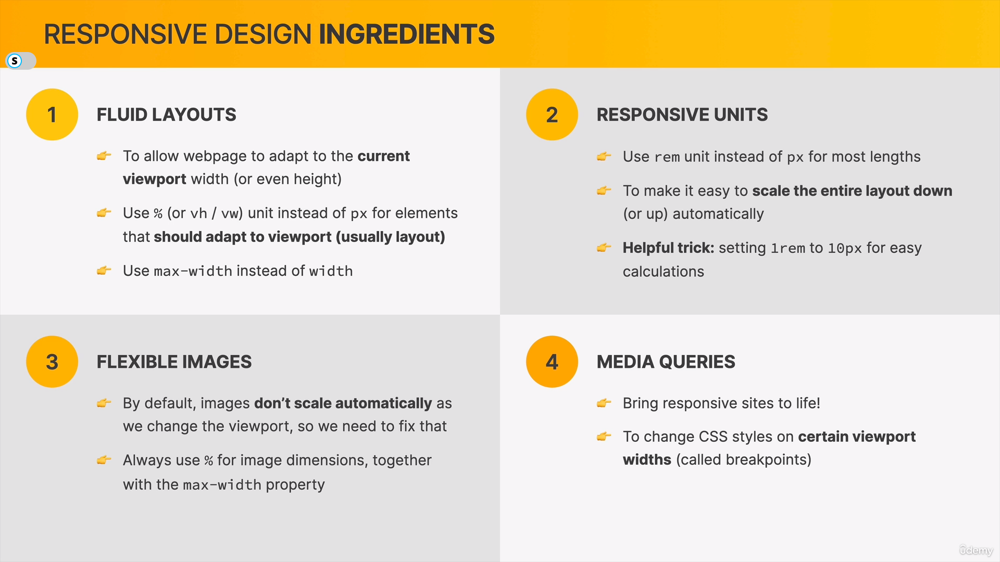
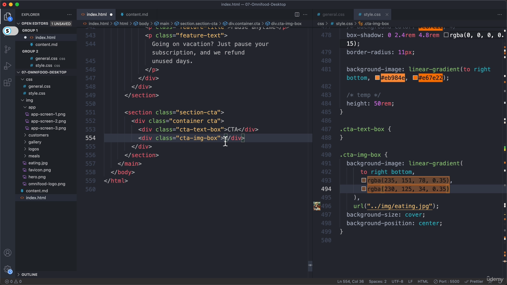

# Simform-Course-HTML-CSS

This repo contains course notes and some practical code of HTML CSS code.

### Responsive Design: 

### Using rem as size: 

### filter property of img:  

### Using not condition: 

### Using two backgrounds at a time:  --> 

### Using role in div element : 

### Strategies for selecting Breakpoints: 

### This Meta tag is very important for mediaQueries to work: <meta name="viewport"content="width=device-width",initial-scale="1.0" />

### Styling based on element attributes: 

### Hiding element without using display: none : 
