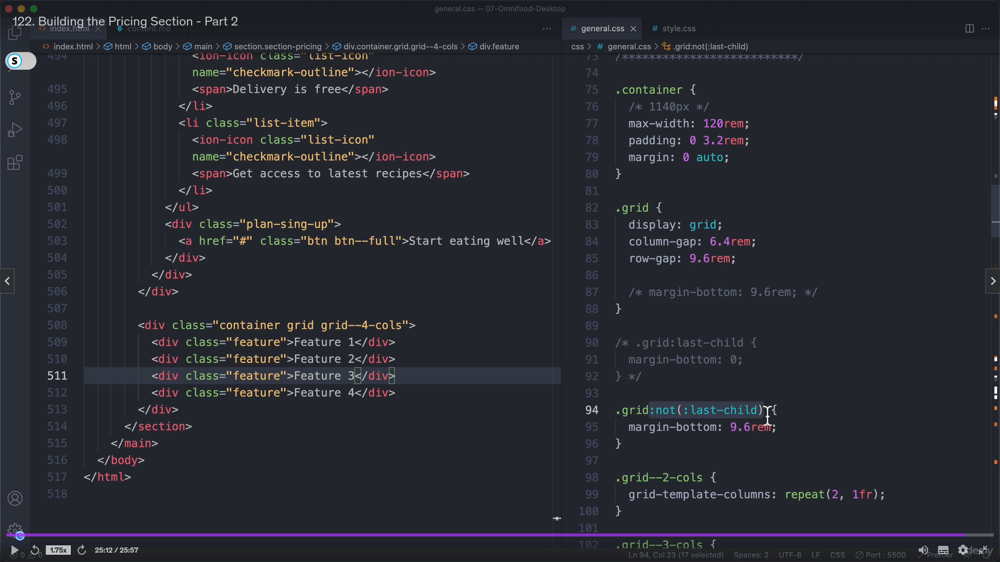
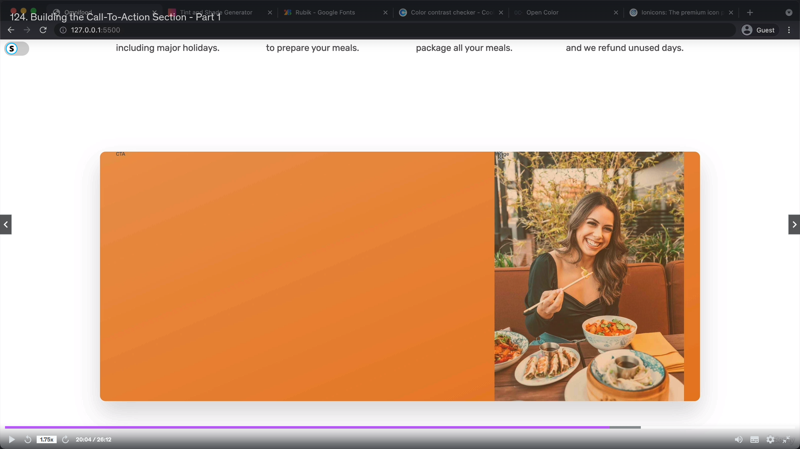
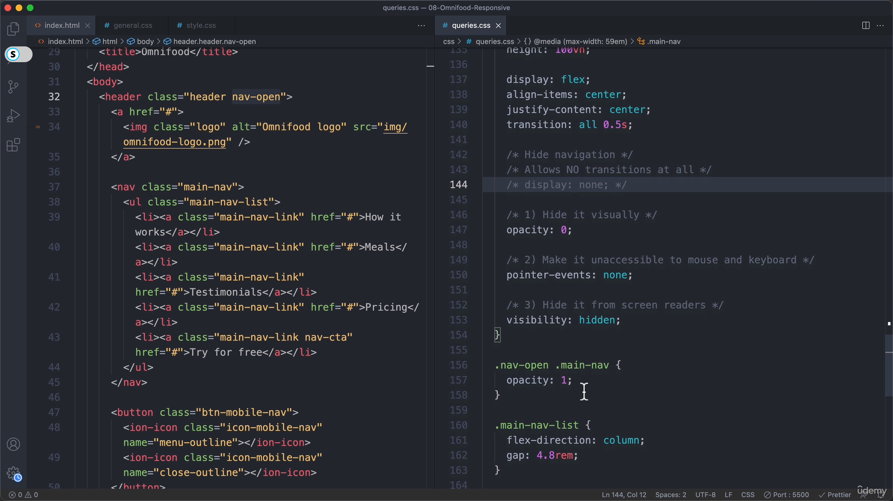
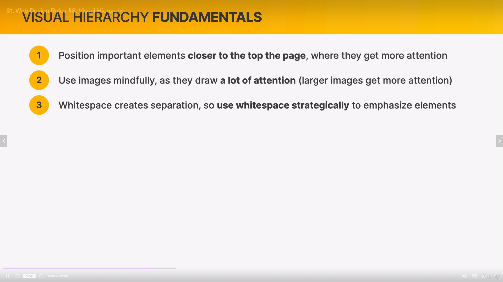
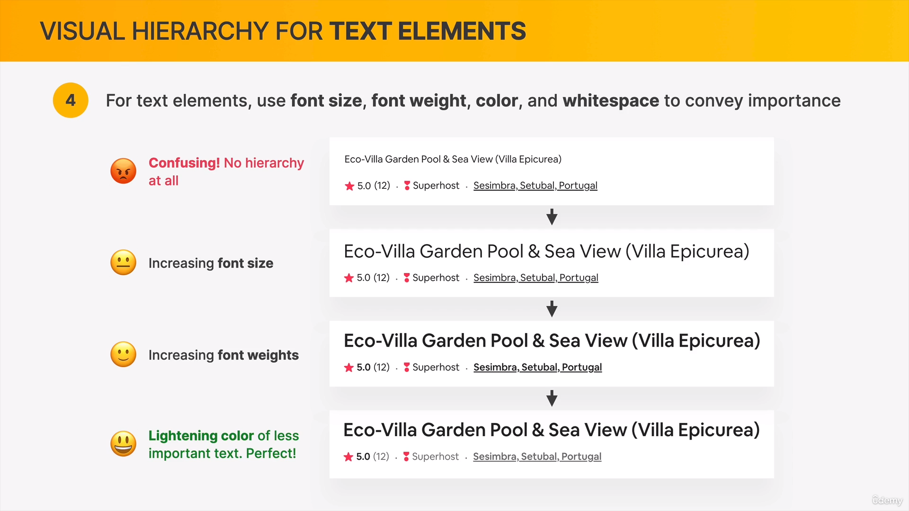

# Simform-Course-HTML-CSS

This repo contains course notes and some practical code of HTML CSS code.

WEBSITE PRESONALITIES:

ESTABLISH A COLOR SYSTEM: 

It is good to have uppercase letters in button text.

Toolbox for images: 

Rules for using Shadows:

box-shadow: 
text-shadow: 

Border radius:

Using White Spaces:

Visual Hirarchy: 

User Experience:

Website-personalities-framework:
Serios/Elegant: 
Minimilist/Simple: 
Plain/Neutral : 
Bold/Confident: 
Calm/Peaceful: 
Startup/Upbeat: 
Playful/Fun: 
