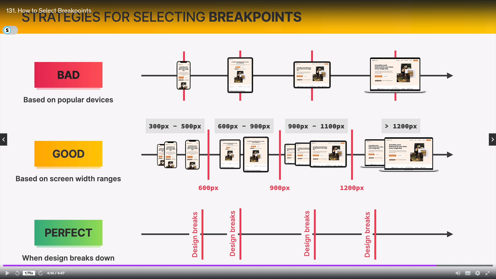
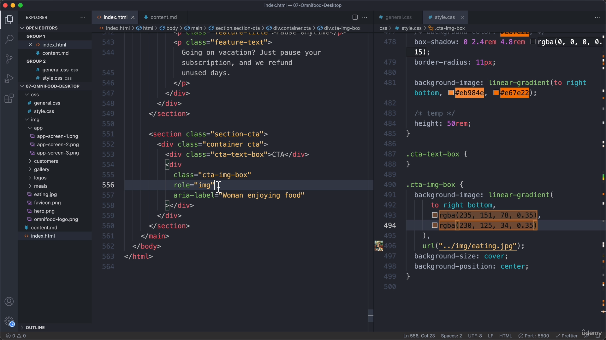
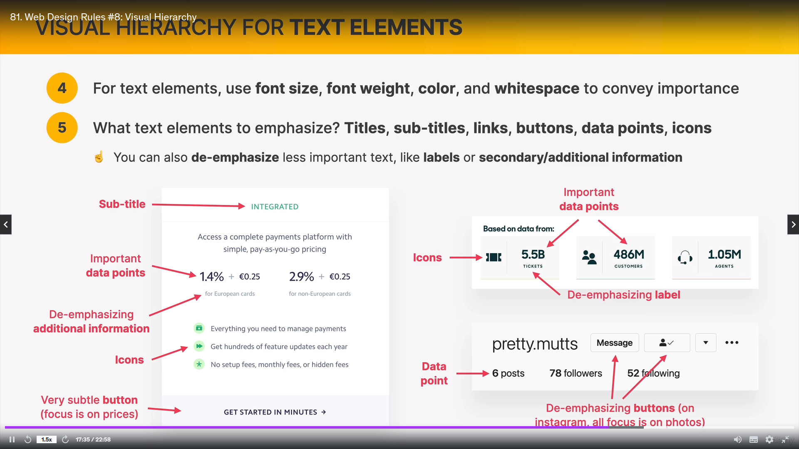

LAYOUT: Structure of arrangin html elements in visually good way.

# 3 Ways Of Building layout:

1. FLOAT:
   

# Heya! --> 

In this image, the div dehind navbar and h1 (red color) does not exist because we have both it's childrens as floating property. It is only visible because of padding given to it (20px x 40px).
So, for that div, those two elements are not actually there because they are floating.

FLOAT vs ABSOLUTE POSITIONING :

BOX-MODEL:box-sizing: border-box 

2. FLEXBOX:

FLexbox terminology : , 

Styling specific order flex item: .el--1{} , .el--2{}  
(here we have given classname as el--1, el--2 to elements)

3. CSS GRID:

Grid terminology:  

using "fr" property: 

grid-column & grid-row :
